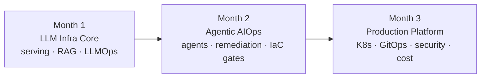

<h1 align="center">AI Infrastructure Engineering — a self-designed 12-week curriculum</h1>

Upgrading 7 years of cloud DevOps into AI infrastructure: LLM serving, RAG, AI agents for operations, and production AI platforms — learned in public, one shipped project per week.

## Who this is for

Cloud/DevOps/platform engineers who want to move into **AI infrastructure, AIOps, or AI platform engineering**. You should be comfortable with a cloud provider, Docker, and some Kubernetes/Terraform. No ML background needed — every hard AI concept is taught by analogy to ops concepts you already know. Details: [FAQ](FAQ.md).

## How to take this course

1. Do [SETUP.md](SETUP.md) (1–2 hrs, ~$10–30 total budget for all 12 weeks)
2. Track progress on the [live dashboard](https://balvanthreddy.github.io/ai-learning/dashboard/) — daily topics, links, interview Q&A, flashcards; progress saves in your browser
3. Follow [PROJECTS.md](PROJECTS.md) week by week — one shipped project every Saturday
4. Write a short [journal](journal/) entry each Sunday and post it — learning in public is part of the method
5. Stuck or improving something? [Discussions](../../discussions) and PRs welcome

## Quick links

| Resource | Link |
|---|---|
| 📊 Progress dashboard (live) | [balvanthreddy.github.io/ai-learning/dashboard](https://balvanthreddy.github.io/ai-learning/dashboard/) |
| ⚙️ Setup guide | [SETUP.md](SETUP.md) |
| 🛠 Step-by-step project build guide | [PROJECTS.md](PROJECTS.md) |
| 🗺 Career roadmap (resume, interviews, job search) | [ROADMAP.md](ROADMAP.md) |
| 🚧 Project portfolio & status | [projects/](projects/) |
| 📓 Weekly journal | [journal/](journal/) |
| ❓ FAQ | [FAQ.md](FAQ.md) |

## Syllabus

| Week | Focus | Ships |
|---|---|---|
| [1](PROJECTS.md#week-1--repo-hygiene-sprint) | LLM fundamentals + portfolio launch | All repos presentation-ready |
| [2](PROJECTS.md#week-2--llm-serving-bench-v1-benchmark-ollama-vs-vllm) | LLM serving & inference (Ollama, vLLM, quantization) | `llm-serving-bench` benchmark table |
| [3](PROJECTS.md#week-3--runbook-rag-v2-production-shaped-rag) | RAG & vector databases (Qdrant, hybrid search, evals) | `runbook-rag` v2 |
| [4](PROJECTS.md#week-4--tokenmeter-v1--langfuse-see-what-ai-costs) | LLMOps & observability (Prometheus, Grafana, Langfuse) | `tokenmeter` cost dashboard |
| [5](PROJECTS.md#week-5--kube-triage-v2-ai-evidence-collector) | AIOps foundations (anomalies, alert pipelines, K8s failure modes) | `kube-triage` v2 |
| [6](PROJECTS.md#week-6--infra-diagnoser-agent-new-small-repo-or-module-in-kube-triage) | AI agents from first principles (tool use, MCP, guardrails) | Read-only infra diagnoser agent |
| [7](PROJECTS.md#week-7--flagship-aiops-remediation-engine-v2) | **Flagship:** agentic remediation with approval gates | `aiops-remediation-engine` v2 + demo video |
| [8](PROJECTS.md#week-8--tf-risk-review-v2-ai--policy-gates-for-terraform) | Terraform + AI + policy-as-code (OPA, Infracost, ArgoCD) | `tf-risk-review` v2 |
| [9](PROJECTS.md#week-9--ai-platform-k8s-serve-a-model-on-kubernetes) | Kubernetes for AI workloads (probes, KEDA, GPU scheduling) | Model serving on K8s, autoscaled |
| [10](PROJECTS.md#week-10--cicd--gitops-for-ai-systems) | CI/CD & GitOps for AI (eval gates, ArgoCD, canary) | Eval-gated deploy pipeline |
| [11](PROJECTS.md#week-11--ai-security-governance--cost-routing) | AI security, governance & cost (OWASP LLM, NIST AI RMF) | Red-team doc + gateway cost routing |
| [12](PROJECTS.md#week-12--capstone-polish--interview-blitz) | Capstone polish & interview prep | Both flagships public, demos recorded |

## The career track (optional)

Unlike most AI courses, this one includes the job-hunt machinery: [ROADMAP.md](ROADMAP.md) has resume rewrites per target role, an interview prep plan (the dashboard bundles 19 Q&As and 38 flashcards), a LinkedIn strategy, and a job search playbook. Skip it if you're here just for the skills.

## About

Built and maintained by [Balvanth Reddy Gandra](https://github.com/balvanthreddy) — Senior Cloud DevOps Engineer, 7+ years on CDC mission-critical systems (AWS · Azure · GCP), taking this exact course in public. Corrections and suggestions welcome — open an issue or PR. [License: CC BY 4.0 / MIT](LICENSE.md).
